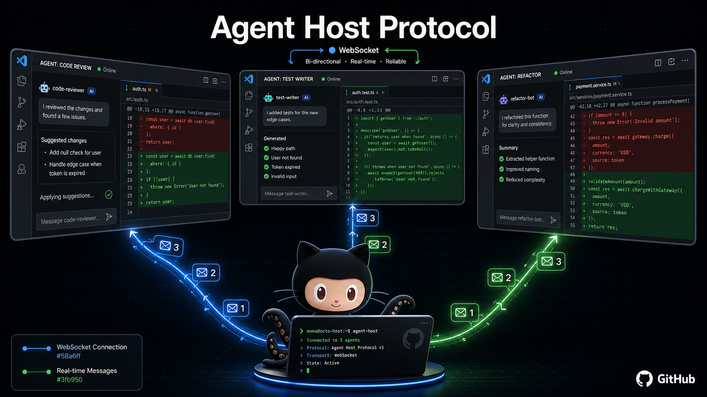

# copilot-remote-host

CLI to discover, connect, and monitor remote VS Code Agent Host instances via the Agent Host Protocol (AHP) WebSocket interface.

VS Code 1.134 (August 19, 2026) formalized the Agent Host as a standalone process that owns agent sessions independently of any editor window. You can start one with `code agent host`, expose it through a dev tunnel, and connect from multiple VS Code windows or custom clients. This tool lets you interact with those hosts from the terminal.

## What it does

- **Discover** — Scans for running Agent Host processes and probes default AHP ports
- **Connect** — Opens an interactive AHP console over WebSocket (JSON-RPC REPL)
- **Monitor** — Live-streams every AHP action with timestamps and sequence numbers
- **Sessions** — Lists active agent sessions on a remote host
- **Send** — Sends a user message to the active session and streams the response
- **Status** — Probes host capabilities, version, and session state

## Install

```bash
npm install -g copilot-remote-host
```

Or run directly:

```bash
npx copilot-remote-host discover
```

## Usage

### Start a host (VS Code 1.134+)

```bash
# Local host with auto-generated connection token
code agent host

# Exposed through a dev tunnel for remote access
code agent host --tunnel
```

### Discover local hosts

```bash
copilot-remote-host discover
```

### Connect interactively

```bash
copilot-remote-host connect ws://127.0.0.1:4040 --token <token>
```

In the REPL, type AHP method calls:

```
ahp> sessions/list
ahp> host/capabilities
ahp> quit
```

### Monitor live actions

```bash
copilot-remote-host monitor ws://127.0.0.1:4040 --token <token>
```

Output:

```
[0.1s] #41 chat/turnStarted — Add retry logic to the API client
[0.3s] #42 chat/delta — Sure — I'll wrap the fetch call...
[1.2s] #43 chat/toolCallStart — editFile on src/api.ts
[3.8s] #46 chat/toolCallComplete — ok · 1 file changed
[4.0s] #47 chat/turnComplete — turn t_8c1 done
```

### List sessions

```bash
copilot-remote-host sessions ws://127.0.0.1:4040 --json
```

### Send a message

```bash
copilot-remote-host send ws://127.0.0.1:4040 "Refactor the auth module"
```

Streams the agent's response to stdout in real time.

## Why this matters

The Agent Host decouples agent sessions from the editor window lifecycle. Sessions survive window closes, run on remote machines next to the code, and accept connections from multiple clients simultaneously. This is the foundation for:

- **Headless CI agents** — drive Copilot sessions from pipelines without a GUI
- **Multi-window pairing** — two developers watching the same agent session
- **Remote workspaces** — agent runs on the server, you watch from your laptop
- **Custom dashboards** — build monitoring tools on top of the AHP stream

## AHP Protocol Notes

The Agent Host Protocol uses JSON-RPC over WebSocket with:

- **Immutable state + pure reducers** for synchronized multi-client views
- **Monotonic sequencing** so every client sees the same ordered action stream
- **Optimistic dispatch** with server-echo reconciliation
- **Channel-based subscriptions** for sessions, chats, terminals, and changesets

Reference: [Agent Host Protocol docs](https://microsoft.github.io/agent-host-protocol/)

## Requirements

- Node.js 18+
- VS Code 1.134+ (for `code agent host`)
- `ws` npm package

## License

MIT
